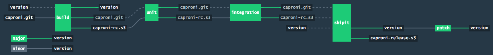

# Caproni: Concourse native

## Status

**WORK IN PROGRESS!**

## Introduction

[concourse]: https://concourse-ci.org/[Concourse]
[concourse tutorial]: https://concoursetutorial.com/
[concourse resource]: https://concourse-ci.org/resources.html
[gianni caproni]: https://en.wikipedia.org/wiki/Giovanni_Battista_Caproni




Although there are some tutorials and sample projects for the [Concourse] CI/CD system, they focus on the "easy case": Linux only and interpreted languages.

This project on the other hand shows how to use Concourse to build, test, package and deliver any language that requires a **native compilation** step such as C or C++ on multiple platforms (Linux, Mac OS X, Windows).

We assume a basic familiarity with Concourse, which can be obtained for example by following the [Concourse tutorial].

The name _Caproni_ is an homage to [Gianni Caproni], Italian pioneer of aviation. I choose this name since in Concourse everything has an aviation theme.

# Concourse and (sometimes) containers

In Concourse, a Linux worker does each step within a Docker image (what is called a [Concourse resource]), guaranteeing total isolation and reproducibility, up to the point that a Linux worker doesn't need anything installed besides the concourse binary.

On the other hand, non-Linux workers such MacOS and Windows are "old-style": there is no isolation or virtualization, so care must be used at two moments:

* the build or test jobs must not leave around artifacts or state on the worker (for example, do not change the Windows registry)
* the worker configuration (e.g. which build system, which toolchain, which dependencies) must be controlled with a configuration management system like SaltStack or Ansible, or even better be an immutable image created with tools like Packer, to guarantee that:
** if using multiple workers of the same type, all these workers are completely equivalent (if a job succeeds on host A, it MUST succeed also on host B)
** if adding a worker of the same type, the new worker must be equivalent to the old ones.
* Depending how how you are deploying your infrastructure, you should consider destroying and re-deploying all your Windows and Mac workers daily.

The Concourse documentation is focused on Linux and only indirectly you realize that on non-Linux the situation is different.

# Getting started with Concourse

This project requires a Concourse system plus S3 and secrets management. If you don't have access to a Concourse deployment, you can use [marco-m/concourse-in-a-box](https://github.com/marco-m/concourse-in-a-box): an all-in-one Concourse CI/CD system based on Docker Compose, with Minio S3-compatible storage and HashiCorp Vault secret manager.

# Project characteristics

## S3 bucket structure

We assume that the same bucket, `concourse/`, is used by multiple pipelines. As such we use the following convention:

```
builds/<pipeline-name>/<versioned-package-name>
```

We use one bucket with multiple directories (this is just our convention):

```
caproni/         (1)
├── _concourse/  (2)
├── artifacts/   (3)
└── final/       (4)
```
1. Bucket name, same name as the project.
2. Metadata needed by Concourse, for example the version file used by the semver resource.
3. Build artifacts.
4. Final build artifacts, for example the release packages.

## Artifacts naming and contents

The Concourse S3 resource supports only one file, so we create one big `artifacts` archive that contains everything we need.

Although artifacts and final go into separate directories in the bucket, to avoid confusion it is better to keep the names uniques:

* `PROJECT-artifacts-BRANCH-VERSION.tgz`, for example `caproni-artifacts-master-1.2.3.rc-42.tgz`
* `PROJECT-final-BRANCH-VERSION.tgz`, for example `caproni-final-master-1.2.3.rc-42.tgz`

The `artifacts` archive contains everything needed by the subsequent steps in the pipeline, so for example contains the test executables.

The `final` archive contains only assets sent to the customer/user of the project, so for example no test executables.

WRITEME

## Pipeline naming

Long-lived pipelines

* PROJECT-master <== the master branch
* PROJECT-stable <== optional, depends on how project is released
* PROJECT-MAJOR.MINOR <== optional, depends on how project is released

Short-lived pipelines

* PROJECT-feat-BRANCH <== string `feat` can be used to select all of them and makes it clear what type of branch it is

## Concourse teams

It might (or not) make sense to use two teams in addition to the main team. One for the long-lived official pipelines, one for all the feature pipelines ?

The rationale for such separation is to make it more difficult to make a change to a release pipeline by error.

On the other hand, the current Concourse authorization system does not allow to be logged into a team (say `features`) and be able to even read (write is not needed here) the `master` team, so the user experience would be unaceptable. The only work around would be to `expose` the master pipelines, which is again ofen unaceptable from a security / information disclose point of view.

WRITEME ELABORATE

## Concourse and branches

Concourse (at least in the 3.x series in 2018) is meant to build master and release branches; it doesn't have built-in support for feature branches, although there are 3rd-party resources at different level of liveness.

Waiting for {concourse-spaces} to land in Concourse, it is still possible to handle without any problem feature branches, either manually (developer adds a pipeline for a specific branch just after the first git push) or automatically (custom resource that observes a repository and creates a pipeline each time a new branch matching a certain pattern is seen).

### Feature branches

WIP

There are many differences between a master or release branch and a feature branch:

* lifetime
* versioning
* triggering
* delivery target
* identity (digital signature, ...)

As such, we cannot just use the master branch as a template, we need a dedicated template for feature branches.

Especially we don't want to allow to bump the semver in a feature branch, or even use the semver, it would be misleading. So probably we just use a build number (there is a 3rd party resource for that).

### Pull request branches

At a very miminum a PR branch differs from a feature branch because it should be auto triggering on changes to the branch.

Probably the feature pipeline should be used and modified to autotrigger, could even be renamed to, say, PROJECT-pr-BRANCH because we would keep the build history! Even elegant!

WRITEME

## Directory structure

We configure the build with CMake and follow the idea of out-of-source build.

Repository:

```
CMakeLists.txt  <1>
ci/             <2>
src/            <3>
```
<1> The top-level cmakelist
<2> Build scripts and councourse pipeline configurations.
<3> The source code of the project


Not tracked: build directory (created on the fly by CMake):

```
builds/
  mac-debug/
  mac-release/
  linux-debug
  linux-release/
  windows-debug/
  windows-release/
```

## The pipeline shape

We have two option: either _hide_ the different platforms inside conceptually-identical jobs:

IMAGE

or bring the platforms out and make them visible as jobs:

IMAGE

Both have pros and cons.

- visibility of what went wrong from the pipeline view
- build failure has different effects to whole pipeline lifetime
- simplicity of configuration files

We go with the simple approach of hiding the different platforms inside the same jobs.

== TODO

* 2 pipelines, one for master, one for release ?
* Dockerfiles and docker pipelines
* Windows VM
* Windows clang ??? http://blog.llvm.org/2018/03/clang-is-now-used-to-build-chrome-for.html
* Mac VM ???

== Stuff to fix

Copy the postgresql database to recover in case the update failed:
http://www.pgbarman.org/
Barman, Postgresql hot backup and disaster recovery

on the other hand, for what I want to do, probably pg_dump (part of postgresql) is already enough. Or not.


docker

docker build . -f Dockerfile-alpine-cpp-buildtools

docker images

docker run -a stdin -a stdout -i -t alpine /bin/sh

docker build . -f Dockerfile-alpine-cpp-buildtools -t marcomm/ready-to-build:latest

docker push marcomm/ready-to-build:latest
